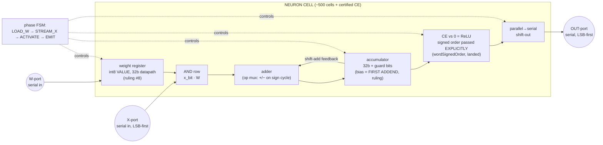
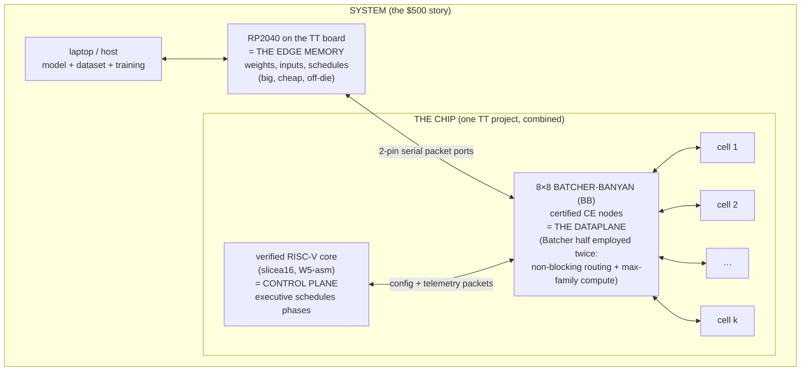

# THE NEURAL DATAFLOW FABRIC — PoC DESIGN PACKAGE v1

### Maestro, 2026-08-09 ~10:2x, at the Captain's six asks ("But if we do
### this, I'd want details like…"). STATUS: DESIGN PACKAGE FOR DECISION —
### nothing here is dispatched to silicon/build until the Captain chooses
### the path. Extends `neural-graph-machine-sketch.md` (the dream record,
### §0–§6b) and `packet-io-demo-sketch.md` (the port substrate). The
### personal story is documented separately: `midnight-to-silicon-story.md`.

**The one-sentence architecture:** a packet-routed dataflow machine —
bit-serial neuron cells at the leaves of the certified banyan fabric,
weights streaming from the edge in lockstep with values (traffic, not
storage — §1 fan-in), activations crossing in wires and never touching
memory, big cheap memory at the edge, a small verified
RISC-V core as control plane — every step from configuration to activation
a theorem. Architecturally distinct from systolic-array accelerators
(TPU-class): asynchronous packet routing over a switching network, not a
synchronous matrix pipeline; the natural workload is *irregular* dataflow
(GNNs, sparsity), where a GPU's bottleneck is gather/scatter and ours is
native wiring.

---

## 1. THE CELL (the unit of operation)



**Operation.** Weights arrive as packets on the W-port and latch — one
per input in the general dual-stream mode (§ fan-in below; latch-once is
the CNN special case). Values stream LSB-first on the X-port; each bit ANDs against
the full latched weight and shift-adds into the accumulator — a classic
serial-parallel MAC. The **bias costs zero gates and one cycle**: it STREAMS as the
first addend through the MAC path itself (maestro ruling at silicon's
11:3x catch — a parallel preload would cost a 32-flop load mux; the
streamed form is the one that is actually free). After the last input, the nonlinearity is applied **in
parallel** by the compare-exchange organ with one input tied to
zero (ReLU = max(a,0) = half a CE); the result re-serializes out
LSB-first for the next layer's MACs.

> ⛔→✅ **THE ORDER QUESTION — two refutation rounds, 10:31–10:34, both
> folded here.** Round 1 (math): "landed organ" over-claimed — the
> sorter certificate is order-GENERIC, and instantiated at BitVec's
> default UNSIGNED order, max(a, 0) = a for every negative a: ReLU
> silently becomes the identity, the network an affine map, every
> theorem green. Round 2 (compiler): **the signed ingredient is not
> missing — it is landed in the corpus**: `wordSignedOrder :
> LinearOrder Word` (`Perm.lean:74`, an `abbrev`, **deliberately NOT
> an instance**) and `batcher8_sortsTo_word` (`Perm.lean:384`), the
> word-level sortedness theorem already at the signed order; math's
> premise came from a stale gap-note in `SortDemo.lean` (compiler's,
> repair owned). **What survives is the DISCIPLINE, and it binds this
> design: the PoC's activation passes `wordSignedOrder` EXPLICITLY,
> exactly as `runNetW` does (`@runNet _ Word wordSignedOrder …`), and
> NEVER promotes it to an `instance` — with the bundle merely in scope,
> plain `≤` still elaborates to the UNSIGNED order (measured,
> `Perm.lean:85-94`); a global instance would silently reinterpret
> every downstream BitVec comparison.** Third instance of the defect
> class (`slt` signed-where-unsigned · ReLU unsigned-where-signed ·
> the bundle-in-scope shortcut): *the certified thing computes an
> order; the instantiation carries the semantics — name the order in
> the term.*

**The LSB-first question — answered, not a problem.** Addition wants
LSB-first; comparison wants MSB-first; the tension dissolves because the
accumulator is a *parallel* register: serial in → parallel accumulate →
parallel CE → serial out. No serial comparator exists in the design. Two
standard details, both cheap:

- **Sign (two's complement):** the value's final (sign) bit is
  subtractive — on that one cycle the adder subtracts instead of adds.
  One mux on the adder op.
- **Guard bits:** accumulating N products needs log2(N) headroom above
  the product width. Number format per **RULING #8**: **int8 fixpoint
  VALUES on the landed 32-bit datapath** (sign-extended at ingress;
  activation compares at 32 with `wordSignedOrder`; the int8 bound
  makes overflow witnesses a one-line `decide`). The 8-bit-NATIVE
  datapath — 8b latches, 8-cycle MACs, shift+saturate requant — is
  the v2/production optimization, priced as reference only.

> 📌 **FAN-IN — GENERAL NEURONS, ruled at the Captain's 14:2x catch
> ("a neuron has an unbounded number of inputs, each with different
> weights"): the general mode is DUAL-STREAM — the W-port and X-port
> advance in lockstep (w_i latches, x_i streams against it; repeat
> indefinitely), the accumulator folding across all inputs. UNBOUNDED
> FAN-IN COSTS TIME, NOT SILICON: weights are traffic from the edge,
> never cell storage ("a small amount of storage is fine" — the 3am
> spec, architecturally vindicated). "Weight-stationary" is the CNN
> SPECIAL CASE (one kernel latched, image streamed). Phase sequence
> generalizes to (LOAD_W → STREAM_X)* → ACTIVATE → EMIT — an FSM/
> schedule loop, zero new silicon, landed organs unchanged. The real
> fan-in bound is the B5 overflow bound (int8 products in a 32b
> accumulator: fan-in ~10^5 headroom), compiler-checked per network.**

**Cost, to be priced exactly by silicon:** order 100–150 flops + an
adder + AND row + small FSM ≈ **~500 cells**; the CE is the existing
certified organ. Several cells fit beside the fabric on a TT allocation.
Multiple *logical* neurons time-multiplex on one physical cell (weights
re-latch per phase — weights are traffic, not storage).

> ⚠️ **SYMBOL CONVENTION (ruled at the Captain's 13:0x stumble +
> his letter ruling — "2k reads as 2*1024"): the frame protocol's
> address-bit count is now **`r` (ROUTE BITS)** — r = log2(ports)
> = 3 for the 8×8 fabric, **header = 2r = 6 cycles**, one ACT per
> route bit. The 1990 paper's own vocabulary, and it cannot be
> misread as kilo. This document's `k` remains the NEURON CELL
> count (4 in the minimal demo); salt's `K` is the (7.3) majorant
> parameter. Older ③/④ docs write the frame's `k` historically —
> read their `k` as `r`.**

## 2. THE FABRIC — chip level and system level



**Chip level.** One combined TT project (the layout-fork option 2 shape —
on-die packets require it, since separate TT projects are power-gated and
never coexist): the certified 8×8 fabric in the middle; k neuron cells on
its leaf ports (k sized by area after silicon prices the cell — target
4–8); the small verified core attached as one more fabric client; 2-pin
serial packet ports at the pins.

> 📌 **THE FABRIC IS THE BB — Batcher-banyan, the Captain's
> architecture — not a bare banyan (clarified at his 10:4x question).
> The Batcher half is employed TWICE: (a) as the classical
> non-blocking front-end — sort by destination, then route — which
> gives the layer-compiler total schedule freedom (ANY permutation
> per round, no banyan-admissibility side-condition in the delivery
> theorems); (b) as the max-family COMPUTE engine (§1, §5) — in a
> phone switch the sorter is routing tax; here the same certified
> silicon (`batcher8_sorts`) is the nonlinearity. Port budget: 8
> ports = k cells + the CPU client + edge ports (e.g. 5 + 1 + 2) —
> the classic effective-ports discount, deliberately spent.** Three traffic classes, one substrate:
**weight packets** (edge → cells, config phases), **activation packets**
(cell → cell, compute phases), **gradient packets** (the reverse routes —
the recorded-winner paths make backprop *routing*, demo-tier).

**System level.** The TT board's RP2040 is the edge memory — exactly the
"lots of memory at the edge where it is cheap" half of the thesis. It
holds the model and dataset, feeds weight/input packets, collects
outputs. The host trains (PoC trains off-chip; the chip demonstrates
verified inference + gradient routing). **Scaling story:** two TT boards
PMOD-bridged = two fabric stages — the fabric composes (banyan of
banyans), and the demo photograph is two chips with a visible wire and
certified traffic crossing it.

### 2b. SCALING IN PRINCIPLE (the Captain's 10:5x question: "to, say, 64k chips?")

- **Recursion:** each chip's 8×8 BB is a switching element; a butterfly
  of butterflies is a butterfly. 8⁶ = 262k ports at six chip-stages —
  64k chips is five-to-six hops. Self-routing composes: the address is
  just LONGER (16 bits), each chip consumes its 3. Intra-chip and
  inter-chip are the SAME network at two scales.
- **Batcher at scale:** a global runtime sort does NOT scale (O(log²N)
  synchronized stages — the classical wall). Resolution: **our traffic
  is static per phase (the graph is known at compile time), so the
  sort happens ONCE, in the compiler**, which emits system-wide
  deterministic permutation-round schedules — the Groq
  software-scheduled-network insight, with our twist: the schedule
  ships with a theorem. Valiant load-balancing is the named fallback
  for dynamic traffic (2× hops, zero coordination). On-chip Batcher
  halves keep the compute job regardless.
- **Physics:** 2-pin links = two wires chip-to-chip, clock embedded,
  GALS, no global clock. Honest: 2-pin bisection is thin at 64k;
  links widen into parallel lanes, architecture unchanged.
- **Neural scaling:** ~half a million physical cells; sharding IS
  graph partitioning (min edge-cut = min inter-chip traffic).
  Precedent: SpiNNaker at 10⁶ cores proved the physics; our delta is
  determinism + theorems.
- **THE PUNCHLINE — verification amortizes over replication:** 64k
  identical chips need ONE chip theorem + ONE composition induction
  (the corpus already composes switches) + ONE schedule checker.
  Verification cost grows with the STATEMENT, not the silicon count —
  the exact opposite of testing. At scale the verified approach gets
  RELATIVELY cheaper.
- **The honest wound: faults.** 64k chips will have dead links;
  deterministic schedules are brittle. Answer in our lane: telemetry
  via each chip's control-plane CPU, then RECOMPILE the schedule
  around the fault set — re-verifiable by the same checker. Fault
  tolerance becomes recompilation, not redundant hardware.

### 2c. COMMERCIAL SIZING (the Captain's 10:5x baseline question; ALL
### figures order-of-magnitude estimates, labeled as such)

Figure: `figures/scale-diagram.svg` (the five-level recursion).

- **Node jump sky130→N5-class:** ~100–300× density × ~40–80× clock ≈
  **4k–20k× per unit silicon** (the Captain's "10K times" guess lands
  inside the band). The PoC (~0.25 mm² @130nm) ≈ 0.002 mm² @N5: one
  400 mm² die ≈ hundreds of thousands of PoC-equivalents — so
  commercially the recursion's levels SLIDE (big on-die fabric →
  chiplets → SerDes board → optics rack), 64k tiny chips is not the
  shape.
- **Density vs H100 int8 (~5 TOPS/mm²):** int8 serial cells at N5 ≈
  2–10 TOPS/mm² — same order; parallel MACs win dense matmul by
  ~4–20× at the margin. **On dense matmul we would be building a
  worse TPU — say it plainly.**
- **The two real advantages:** (1) UTILIZATION on irregular
  workloads — GPU GNN utilization is notoriously 1–10% (gather/
  scatter through the memory system); our routing IS the operation.
  A 10× utilization gap erases a 10× peak gap. (2) ENERGY — no
  HBM round trips; activations never leave the wire (Groq-class
  argument, compounding with utilization on graphs).
- **Trust at scale:** one chip theorem + one induction + one schedule
  checker vs testing budgets that grow per-unit across 64k devices.
- **LEVEL-1 PRODUCTION SIZING (the Captain's 150 mm²/30B-transistor
  baseline; his k≈80K guess lands in-band):** the cell's cost is its
  WEIGHT MEMORY, not its MAC — int8 serial MAC ≈ 3–5k Tr, 1 KB
  resident weights ≈ 50k Tr ⇒ ~55k Tr/cell. Budget: **k ≈ 100–150K
  cells** (~7B) + a 128K-port on-die butterfly (~1.1M switch nodes,
  ~5.5B — interconnect costs as much as compute, the classic result)
  + SerDes/control/margin inside 30B. A single Batcher front at 100K
  ports alone would cost ~26B Tr (the §2b global-sort wall, visible
  in silicon) ⇒ **the production die is two-tier: 64-port BB islands
  (non-blocking, Batcher affordable) + a compile-time-scheduled
  global butterfly — the recursion starts ON-die, and the PoC's 8×8
  BB is literally the island tile, replicated ~2,000× per die.**
  Throughput: ~30–40 int8 TOPS serial; ~300 TOPS with 8-lane cells —
  one order under H100 peak, erased on graphs by the utilization
  gap. The product knob is three-way: cells × weights/cell ×
  lanes/cell; the workload picks it. Size anchor, carefully bounded:
  64k dies × 1–8M logical neurons/die ≈ 10¹¹ — a brain's NEURON
  count (synapse count far short; an anchor, not a claim).
- **The commercial one-liner: THE VERIFIED GRAPH MACHINE** —
  deterministic, energy-lean, high-utilization where GPUs crater,
  correctness scaling by induction. Not a TPU competitor; a
  category the incumbents do not occupy.

## 3. THE ON-DIE CPU — yes, and it is the machine we are already building

The core (slicea16, W5-asm assembly underway) rides along as the
**control plane**: it runs the verified executive (B-EXEC) that
sequences phases (LOAD_W / route round / ACTIVATE / EMIT), owns the
routing schedule, maps logical neurons onto physical cells, and handles
telemetry. The dataplane never waits on it — the classic dataflow split,
and the Captain's own 3am words: *"the switch fabric as neural
processor, **managed by the cpu**."*

Stated honestly: a bare FSM sequencer could run a fixed demo without a
CPU. The CPU is included because it is the *point*: it makes the chip
self-hosting (**packet-boot** — the configuration program arrives
through the fabric it will manage), it carries the verified-software
story (tiny-Rust → typed executive → scheduled phases, each a theorem),
and it is the piece that makes the platform *general* rather than one
hardwired network. Its dmem8 + offboard memory (ruling #5) suffices —
configuration state lives in the cells and routing registers, not in
CPU memory.

### 3b. THE PIN BUDGET — memory access on 24 pins (the Captain's 11:3x
### question; TT supplies clk/rst OUTSIDE the 24)

**Option A — RULED FOR SEPTEMBER, CAPTAIN-RATIFIED 11:4x ("we will
surface only weights/inputs/results, otherwise we switch only the
internal k cells... When the time comes to scale to multi-chip
systems, we will add external pins"):
the Captain's multiplexed memory bus, unchanged.** 8 addr + 8 data +
2 phase = 18 pins, CPU served by the RP2040 exactly as slicea16bma
already does — zero new memory design, the verified core as-is.
Remaining **6 pins = 3 packet ports** (edge-in weights/inputs ·
edge-out results · spare/debug). Fabric ports: 8 = 4 cells + CPU
client + 2 edge + 1 spare. **18 + 6 = 24 — exact fit.**

> 📌 **THE PRINCIPLE THAT MAKES THE BUDGET CLOSE (the Captain's 11:4x
> "how do we fit?"): pins are paid ONLY where traffic crosses the die
> boundary. The standalone BB needs 16 IO pins because ALL its clients
> are off-chip; on the NDF, 5 of its 8 ports terminate ON-DIE (4 cells
> + the CPU client) as wires costing zero pins — integration converts
> pins into wires. The CPU's packet side is likewise an internal port;
> only its MEMORY bus crosses. Clocking: TT's harness supplies clk +
> rst_n OUTSIDE the 24 user IOs; ONE clock domain covers fabric,
> cells, CPU, and both ends of every serial port (the RP2040 shares
> the board clock) — 2-pin ports are synchronous data+valid, no
> per-port clocks. Relief valve if more edge bandwidth is ever
> wanted: narrow the memory bus to 4 data pins (double the cycles),
> freeing pins for more packet ports.**

**Option B — the v2 evolution, named: memory as a PACKET SERVICE.**
No memory bus; fetch and data are request/response packets to an
edge memory server — one protocol, one theorem family, the
packet-boot story realized (executive resident in a small onboard
imem, booted through the fabric). Honest price: ~2 tiles for even a
64-word latch imem + new design and proof surface on a September
clock. Revisit from silicon's floorplan data; the architecture
accepts either without structural change.

## 4. A SMALL GNN, COMPILED — the worked example

**The network:** 4 nodes {0,1,2,3}, edges {0–1, 0–2, 1–2, 2–3},
features h ∈ Z² (8-bit fixed point), one message-passing layer:

```
h'_v = ReLU( W_self · h_v  +  Σ_{u ∈ N(v)} W_msg · h_u  +  b )
```

**Compilation output** (the artifact the layer-compiler emits):

```
CONFIG   broadcast W_msg to all 4 cells (ONE weight stream — sharing is
         multicast, not storage); W_self, b per cell (b = first addend, streamed)
ROUND 1  permutation (0 1)(2 3):   h_0↔h_1, h_2↔h_3 cross the fabric;
         each cell MAC-accumulates the arriving message
ROUND 2  permutation (0 2):        h_0↔h_2
ROUND 3  permutation (1 2):        h_1↔h_2
         [the edge set decomposed into 3 matchings; each matching is a
          permutation the banyan routes without conflict]
SELF     each cell streams its own h_v against the latched W_self
ACT      CE vs 0 in every cell; EMIT h'_v
```

**The verified decomposition — three rows: delivery LANDED (family),
activation LANDED (signed order), MAC all-parts-landed with the one
composing join in flight (evidence's 15:44 headline fix — the third
favorable drift of the day; and its F3 boundary stands: this chain is
certified at the KERNEL MODEL, "down to silicon" closes at emitS + a
synthesis run, not here):**

| claim | instrument | status |
|---|---|---|
| each round delivers exactly the multiset {h_u : u ∈ N(v)} to cell v | fabric delivery theorem (per-permutation instance) | **landed family** |
| cell v accumulates b + Σ (W·x) with the sign cycle correct | `MacInduction` (ℤ arithmetic, 12 rows, mutants run) + `MacBridge` rungs 1–3 (hardware: the cell ADDS its trace, BitVec) | **ALL PARTS LANDED (8/9 15:41): accumulation hardware theorem (c754b29) + arithmetic reading through rung 4 (a2c6470+03f5885) + the sign cycle (3c62228). THE JOIN — the one theorem composing trace + sign cycle + mac_correct into b + W·sval — IS NOT YET STATED (math's 15:44 measurement; in flight at its claim). The cell adds, shifts, and subtracts in the kernel; that it computes the signed dot product is one join away.** What is verified in hardware is that the cell adds what it is fed; that the fed sequence *means* b + W·x closes at rung 4, the rung carrying the chain's only hypothesis (math's exact text, 14:28) |
| activation = SIGNED max(·, 0) | CE certificate at `wordSignedOrder`, passed **explicitly in the term** (the `runNetW` pattern) | **landed** (`wordSignedOrder` + `batcher8_sortsTo_word`, Perm.lean) — the binding discipline: never an `instance`; unsigned instantiation would silently make ReLU the identity on negatives (§1 banner, two-round history) |

⇒ composed: `h'_v = ReLU(W_self h_v + Σ W_msg h_u + b)` — **the layer
equation as a kernel theorem**, per compiled schedule. "The platform is
general" is then a staged claim: *the layer-compiler for family F is
verified*, one family at a time — MLP and CNN reuse the same three rows
(a CNN is the same cell with the kernel latched once and the image
streamed past; pooling is the certified Batcher doing order statistics).

**Scale of the demo:** 3 rounds × 4 packets × (2 dims × 8 bits + header)
≈ a few hundred bit-times per layer pass — tens of microseconds at TT
clocks. Bench-visible with a logic analyzer on the PMOD pins.

## 5. THE TRADEOFFS, spelled out

| axis | what we pay | what we get | honest note |
|---|---|---|---|
| bit-serial MAC | 8–32× cycles per MAC | ~same area×time as parallel; 1-wire operands (fabric stays routable); precision = stream length (free 8-bit mode) | high per-op latency — a throughput/pipeline machine, not a latency machine |
| weights streamed in-band | edge port carries weight traffic | zero on-die weight memory; config-through-fabric (the neuron dream literally) | batch-1 dense inference reuses weights poorly on EVERY architecture; ours does not fix LLM-decode-class workloads and we will not claim it |
| weight-stationary cells | re-latch per logical neuron | one weight-load amortized over a whole stream (TPU's own trick, packet-shaped) | virtualization ratio (logical/physical neurons) is bounded by weight-reload traffic |
| banyan topology | log-depth network is BLOCKING; schedules must be permutation-decomposed | landed certified organs; Batcher+banyan = non-blocking if ever needed; natural multicast by rounds | at large n, wire length favors 2D mesh (Cerebras-style); irrelevant at n=8, named for honesty |
| nonlinearity set | smooth functions (softmax, tanh, exp) need LUTs or hard variants | the ENTIRE max family from the certified sorter — ReLU, max-pool, hard-sigmoid/tanh (= 2 CEs), top-k/argmax — at the LANDED signed order, passed explicitly per the §1 discipline | transformers approximable (hardmax attention), not native |
| fixed-point only | no floats anywhere | exactness — theorems are about the actual arithmetic, no ulp gaps | training in fixed point is delicate; PoC trains off-chip, chip does verified inference + gradient ROUTING |
| process/scale (sky130, TT) | ~9 orders of magnitude off a datacenter part | $500-class fabrication; the claim is the VERIFIED INSTANCE of a vindicated architecture class (Groq/Cerebras/TPU-adjacent organization), not a competitive part | say this loudly in every telling |
| programmability | a config compiler must exist and be trusted | ours comes WITH THEOREMS — aimed at the exact flank that killed dataflow machines historically | the compiler theorems are the differentiator; scope them per-family, never "general" |

### 5b. THE FLOAT QUESTION (asked by the Captain 10:4x; every audience will ask it)

Most NNs train in float; we compute in int32/int8. **Not a defect — the
industry-standard deployment split, plus our verification superpower:**

- **Quantized integer INFERENCE is the norm** (TFLite/TensorRT/ONNX
  int8; LLMs at int8/int4; QAT typically costs <1% accuracy). The
  precedent: **TPUv1 was an int8 inference-only machine.** Train in
  float off-chip, quantize, deploy integer — exactly this doc's split.
- **Integers make the theorems TOTAL:** exact arithmetic, bit-for-bit
  statements, `decide`-certifiable (the 2^64-pair adder cert exists
  because ints). Float would drag IEEE rounding through every layer
  and the tropical algebra (§6) would leak — float + is not even
  associative.
- **The float→int gap moves into the OFF-CHIP compiler where it is
  honest:** proved = "the chip computes exactly this integer
  function"; empirical = "this integer function approximates the
  trained model" — measured on the bench, separable, never entangled
  with the kernel chain.
- **The one design consequence: requantization** at layer boundaries
  (int8×int8 → 32b accumulate → scale, shift, CLAMP to 8b — the
  standard int8-NPU pattern and already our accumulator shape). The
  clamp is saturation = min ∘ max = **two CEs: the requantizer's
  nonlinearity is in the certified max family too.** One small organ
  (shift + saturate), not an architecture change.
- bf16-on-fabric is a possible FUTURE organ, named with its honest
  cost: bit-serial float is control-heavy, an FMA dwarfs an int8 MAC,
  and the verification bill balloons. Not PoC territory.

### 5c. THE POWER LEDGER vs TPU/GPU (the Captain's 11:1x question; his
### guess — "well on sparse/GNN, TPU superior on dense" — CONFIRMED in
### both directions, with the mechanisms; all figures order-of-magnitude)

Shared physics (classic per-op figures, modern node): int8 MAC ~0.2 pJ ·
local SRAM ~5 pJ · on-die wire ~0.15 pJ/bit·mm · HBM ~3–7 pJ/bit ·
SerDes ~2–5 pJ/bit. The question is which each architecture pays per
USEFUL op.

- **DENSE: TPU wins 2–5×, at the circuit level.** Systolic reuse
  approaches MAC-limited energy; our serial cell does the same
  adder work but pays clock/control EVERY cycle (~1.5–3× penalty)
  and dense gives routing nothing to buy it back. Delivered:
  H100/TPU ~2–6 int8 TOPS/W vs ours ~1–3. On dense we are a worse
  TPU in energy too — stated plainly.
- **SPARSE/GNN: we win 10–50×, at the system level.** The GPU's
  per-useful-op stack: 1–10% utilization under full static/scheduler
  draw × ~16× cache-line waste on random gathers (4B feature drags a
  64B line) × the HBM round trip per message ⇒ ~1–3 nJ per useful
  feature (~0.05–0.5 TOPS/W delivered on graphs). Ours: 50–250 pJ
  per 32-bit message point-to-point through wires and stages
  (10–30× cheaper), exact-payload packets (no line waste), high
  utilization (routing IS the op), zero scheduler/coherence power
  (the compile-time schedule is silent; deterministic phases
  clock-gate precisely). Delivered ~1–3 TOPS/W held.
- **The ledger in one line: TPUs win dense by doing the same MACs
  with less ceremony; we win sparse by not paying for ceremony
  sparse workloads cannot use.** The win is from not wasting their
  circuits, not from beating them.

## 6. WHAT IS NEW HERE (the Captain's "anything new, or just a dream" test)

Not the hardware genre — bit-serial neural silicon and dataflow machines
are heritage, and we cite them. New, and checkably new: **(i)** the
verified stack end-to-end (routing theorem ∘ MAC induction ∘ nonlinearity
certificate ∘ layer-compiler theorems ∘ executive scheduling — one kernel
chain from GNN equation to gates); **(ii)** the certified-sorter-as-
nonlinearity fusion (the nonlinear engine's proof came free at the
LANDED signed order — with the instantiation discipline of §1's banner:
the order is named in the term, never an ambient instance; the
two-round near-miss is itself part of the story: an unsigned ReLU is
silently affine); **(iii)**
gradient-is-routing made literal in a packet machine (backprop as the
fabric's recorded winner paths). The demo sentence: *a graph network
whose every message, weight, activation, and gradient path is a theorem,
on $500 silicon, from a midnight dream.*

## 7. OPEN QUESTIONS FOR THE SEAT REVIEW (fire on the Captain's word)

- SILICON: price the cell exactly (8-bit format); floorplan fabric + k
  cells + core on candidate tile shapes; k = ?
- MATH: scope the MAC induction (statement form, fuel/cycle indexing);
  confirm the delivery theorem instantiates per-permutation as assumed.
- COMPILER: the layer-compiler rows (GNN first) — schedule emission +
  the three-row correctness table as Lean statements.
- EVIDENCE: the claim fence for the story numbers (tokens, days, $) —
  measured, not vibes, before anything is published.
